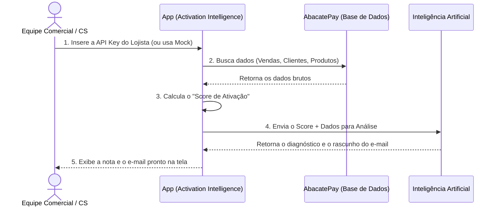

# Activation Intelligence — AbacatePay

O **Activation Intelligence** é uma ferramenta de Customer Success e Vendas B2B para analisar o engajamento e a saúde da integração dos lojistas na plataforma AbacatePay.

## O que a aplicação faz? (Modelo de Negócio)

O objetivo principal é **identificar se um lojista está extraindo o máximo de valor da AbacatePay** e **fornecer insumos prontos para a equipe comercial abordá-lo**.

Em vez de um humano analisar manualmente o painel do cliente, a aplicação:
1. Puxa os dados reais da loja.
2. Calcula um **Score de Ativação (0 a 100)** baseado no uso de recursos (webhooks, checkouts, assinaturas).
3. Usa uma Inteligência Artificial para analisar esses dados e escrever um e-mail personalizado com dicas de melhoria.

### Diagrama Visual do Fluxo

### Resumo de Valor
* **Para a AbacatePay:** Aumenta o volume processado, garantindo que os clientes terminem o setup e vendam mais.
* **Para a Equipe de CS:** Economiza horas de análise de contas e redação de e-mails, entregando contatos ("outreach") mais quentes e direcionados.

## CS Command Center

A aplicação evoluiu de uma ferramenta de análise individual para um **CS Command Center** focado na gestão contínua do portfólio de lojistas, com o objetivo de aumentar a retenção.

### Novas Funcionalidades (Dashboard)

* **Portfólio de Lojistas (Gestão Local):** Uma visão em tabela para gerenciar os lojistas analisados, salvando automaticamente o resultado das análises.
* **Activation Checklist:** Visualização detalhada (dentro da análise) indicando exatamente quais etapas de ativação o lojista completou e quais ainda faltam, com a respectiva pontuação.
* **Régua de Contato (Cadência):** Um sistema inteligente que define a frequência ideal com que o time de CS deve entrar em contato com o lojista, baseado no nível de risco (Score):
  * 🔴 **Risco Crítico (Score 0-30):** Contato a cada **3 dias**.
  * 🟡 **Atenção (Score 31-60):** Contato a cada **7 dias**.
  * 🔵 **Bom Progresso (Score 61-80):** Contato a cada **14 dias**.
  * 🟢 **Ativado (Score 81-100):** Contato a cada **30 dias**.
* **Status de Contato:** O sistema avisa se o contato está "Em dia", "Atrasado", ou se o lojista "Nunca foi contatado", permitindo registrar novos contatos (WhatsApp, Email, etc).
* **Evolução de Score:** Mini-gráficos (*sparklines*) e indicadores (↑/↓) que mostram se a saúde do lojista está melhorando ou piorando ao longo das reavaliações.
* **Exportação CSV:** Extração com 1 clique de toda a base de lojistas filtrada para planilhas.
