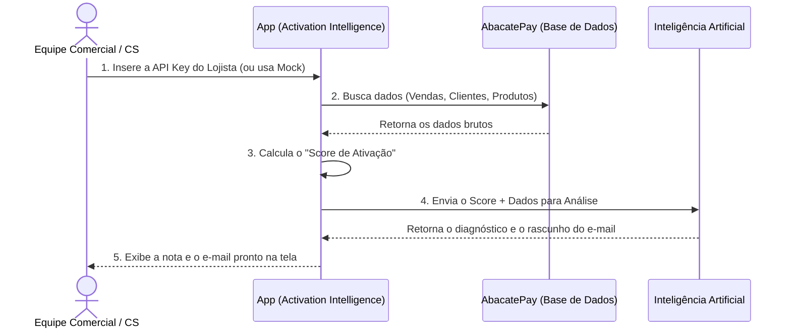

# Activation Intelligence — AbacatePay

O **Activation Intelligence** é uma ferramenta de Customer Success e Vendas B2B para analisar o engajamento e a saúde da integração dos lojistas na plataforma AbacatePay.

## O que a aplicação faz? (Modelo de Negócio)

O objetivo principal é **identificar se um lojista está extraindo o máximo de valor da AbacatePay** e **fornecer insumos prontos para a equipe comercial abordá-lo**.

Em vez de um humano analisar manualmente o painel do cliente, a aplicação:
1. Puxa os dados reais da loja.
2. Calcula um **Score de Ativação (0 a 100)** baseado no uso de recursos (webhooks, checkouts, assinaturas).
3. Usa uma Inteligência Artificial para analisar esses dados e escrever um e-mail personalizado com dicas de melhoria.

### Diagrama Visual do Fluxo

### Resumo de Valor
* **Para a AbacatePay:** Aumenta o volume processado, garantindo que os clientes terminem o setup e vendam mais.
* **Para a Equipe de CS:** Economiza horas de análise de contas e redação de e-mails, entregando contatos ("outreach") mais quentes e direcionados.
